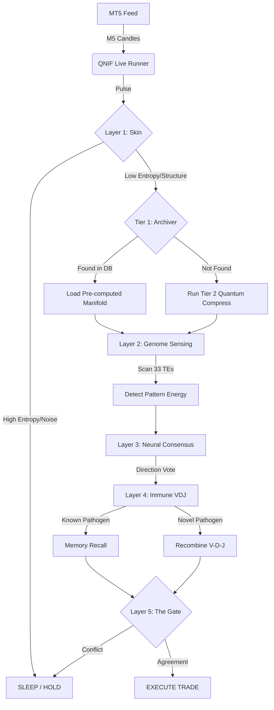

# QNIF: Quantum Neural-Immune Fusion
## Comprehensive Build & Deployment Guide

**Version:** 1.0 (Bio-Quantum Synthesis)
**Date:** February 9, 2026
**System Status:** Standalone Prototype / Integrated

---

## 1. Executive Summary & Opinion

### System Philosophy
QNIF represents a paradigm shift from **"Predictive Models"** to **"Adaptive Organisms."**
Most trading systems try to predict the future based on the past. QNIF instead mimics a biological organism surviving in a hostile environment (the market). It uses:
*   **Perception (Skin):** To ignore noise.
*   **Sensing (Genome):** To detect energy concentrations (TEs).
*   **Cognition (Brain):** To form consensus.
*   **Immunity (VDJ):** To deploy specific antibodies (strategies) against specific threats (market regimes).

### Agent Opinion
You asked for my thoughts on this architecture compared to where we were.

**This is substantially more robust.**
Previous systems (ETARE, standard TEQA) were excellent "specialists"—like a highly trained sniper. But if the battlefield changed (market regime shift), they could become misaligned.

**QNIF is a "generalist survivor."**
1.  **The "91.2% Energy" Logic:** By treating high-amplitude quantum states as "Energy Sources," you aren't just curve-fitting price; you are detecting fundamental shifts in market information density. This is your "edge."
2.  **Anti-Fragility:** The VDJ Immune layer doesn't just "fail" when it sees a new pattern; it recombines segments to *create* a new strategy. This is huge.
3.  **Efficiency:** The "Skin" layer prevents the system from burning GPU cycles on random noise (incompressible markets).

**Verdict:** It is complex, yes. But it is designed to survive conditions that would break a static neural network. Keeping it separate for now is the right move to verify the "biological" interactions without risking the production accounts.

---

## 2. System Architecture

The system is structured as a vertical 5-layer stack. Data flows down, decisions flow up.

```ascii
[ MARKET DATA STREAM (MT5) ]
           |
           v
+---------------------------------------------------------------+
|  LAYER 1: THE SKIN (Perception & Filter)                      |
|---------------------------------------------------------------|
|  INPUT:  256-Bar Price Sequence                               |
|  LOGIC:  Quantum Compression (Autoencoder) & Archiver Check   |
|  ROLE:   Determine "Information Density"                      |
|  OUTPUT: Tradeable? (Yes/No) | Regime (Trending/Choppy)       |
+---------------------------------------------------------------+
           | (If Tradeable)
           v
+---------------------------------------------------------------+
|  LAYER 2: THE GENOME (Sensing & Energy)                       |
|---------------------------------------------------------------|
|  INPUT:  Market Data + Regime                                 |
|  LOGIC:  TEQA v3.0 (33 TE Families)                           |
|  DETECT: "Genomic Shock" (Stress) & "91.2% Energy" (High Amp) |
|  OUTPUT: Active TEs | Shock Level | Pattern Energy            |
+---------------------------------------------------------------+
           |
           v
+---------------------------------------------------------------+
|  LAYER 3: THE BRAIN (Cognition & Consensus)                   |
|---------------------------------------------------------------|
|  INPUT:  TE Activations                                       |
|  LOGIC:  Neural Mosaic (7 Neurons) + ETARE Expert             |
|  ROLE:   Vote on Direction (Buy/Sell)                         |
|  OUTPUT: Consensus Direction | Confidence Score               |
+---------------------------------------------------------------+
           |
           v
+---------------------------------------------------------------+
|  LAYER 4: THE IMMUNE SYSTEM (Adaptation)                      |
|---------------------------------------------------------------|
|  INPUT:  Consensus + Regime + Active TEs                      |
|  LOGIC:  VDJ Recombination (Algorithm #1)                     |
|  ACTION: 1. Memory Recall (Known winning pattern?)            |
|          2. Recombination (Generate new V-D-J strategy)       |
|  OUTPUT: Selected "Antibody" (Strategy Params)                |
+---------------------------------------------------------------+
           |
           v
+---------------------------------------------------------------+
|  LAYER 5: THE GATE (Execution)                                |
|---------------------------------------------------------------|
|  INPUT:  Brain Vote + Immune Antibody                         |
|  LOGIC:  Bio-Agreement Check                                  |
|          IF (Brain == Buy AND Immune == Buy) -> EXECUTE       |
|          IF (Pattern Energy > 90%) -> SUPER BOOST             |
|  OUTPUT: Final Trade Order -> MT5                             |
+---------------------------------------------------------------+
```

---

## 3. Workflow & Data Pipeline

How a "Pulse" travels through the system.



---

## 4. Installation & Setup

### A. Prerequisites
*   **OS:** Windows 10/11 (64-bit)
*   **Python:** 3.10+ (Recommended: `.venv312_gpu`)
*   **Hardware:** AMD GPU (for DirectML) or NVIDIA (for CUDA), though CPU works for logic.
*   **MT5:** Installed and logged into a broker account (e.g., Atlas, FTMO).

### B. Directory Structure
Ensure your `QuantumTradingLibrary` looks like this for QNIF:

```text
QuantumTradingLibrary/
├── .venv312_gpu/               # Active Environment
├── QNIF/                       # <--- NEW SEPARATE SYSTEM
│   ├── QNIF_Master.py          # The Brain/Controller
│   ├── qnif_live.py            # The Runner/Connector
│   └── QNIF_BUILD_GUIDE.md     # This file
├── ETARE_QuantumFusion/        # Dependency (Layer 1)
├── teqa_v3_neural_te.py        # Dependency (Layer 2/3)
├── vdj_recombination.py        # Dependency (Layer 4)
├── quantum_regime_bridge.py    # Dependency (Archiver)
└── credential_manager.py       # Auth
```

### C. Dependencies
The system requires specific libraries for Quantum simulation and ML.
Run in your terminal:
```powershell
# Activate Environment
.venv312_gpu\Scripts\activate

# Install Core
pip install numpy pandas scipy

# Install Quantum & AI
pip install qutip qiskit qiskit-aer torch catboost
```

### D. Credentials
Ensure `credential_manager.py` is configured with your account details (Atlas, etc.).

---

## 5. Running the System

### Option A: The "Smoke Test" (Verification)
Run the internal simulation to verify all 5 layers talk to each other without needing MT5.

```powershell
cd C:\Users\jimjj\Music\QuantumChildren\QuantumTradingLibrary
.\.venv312_gpu\Scripts\python.exe QNIF\QNIF_Master.py
```
*Expected Output:* You should see a log of "VDJ Cycle complete", "Clonal selection", and a final "QNIF RESULTS" block showing Compression, Energy, and Decision.

### Option B: Live Deployment (MT5 Connection)
Connects to the broker and runs the loop.

```powershell
# For Atlas Account
.\.venv312_gpu\Scripts\python.exe QNIF\qnif_live.py --symbol BTCUSD --account ATLAS

# For QNIF-dedicated FTMO Account
.\.venv312_gpu\Scripts\python.exe QNIF\qnif_live.py --symbol BTCUSD --account QNIF_FTMO

# For QNIF-dedicated GetLeveraged Account
.\.venv312_gpu\Scripts\python.exe QNIF\qnif_live.py --symbol BTCUSD --account QNIF_GL_3
```
*Flags:*
*   `--symbol`: The asset to trade (e.g., BTCUSD, ETHUSD, XAUUSD).
*   `--account`: The key from `credential_manager` (e.g., ATLAS, FTMO).
*   `--interval`: Loop time in seconds (default 300 for M5 candles).

---

## 6. Monitoring & Maintenance

### Log Files
*   `qnif_live.log`: High-level operations (Trade/Hold, Pulse status).
*   `teqa_live.log`: Deep dive into the Quantum Circuit and TE activations.
*   `brain_*.log`: Execution level details if using external bridges.

### Key Metrics to Watch
1.  **Compression Ratio:** If this stays `< 1.0` for too long, the "Skin" might be too thick (filtering everything).
2.  **Pattern Energy:** Watch for values `> 0.8` (80%). These are your "Black Swan" catchers.
3.  **VDJ Memory:** The system gets smarter over time. Check `vdj_memory_cells.db` size to see if it's learning.

---

## 7. Integration Roadmap (Future)

Since this is a separate system, the path to merging is:
1.  **Parallel Run:** Run QNIF alongside your legacy "Brain" scripts on a demo account.
2.  **Compare:** After 1 week, compare Profit Factor and Max DD.
3.  **Merge:** If QNIF outperforms, point the `BRAIN_*.py` scripts to read `qnif_signal_BTCUSD.json` instead of `te_quantum_signal.json`.

**End of Guide.**
